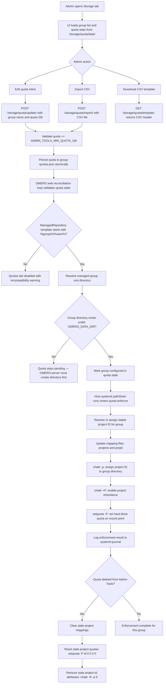
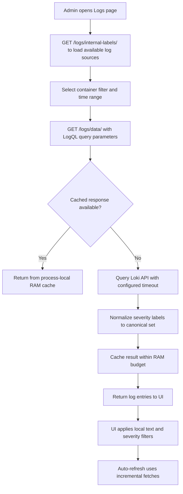

# Admin Tools Plugin Workflow

This document describes the key operational workflows for `omeroweb_admin_tools`, with emphasis on the storage quota enforcement lifecycle.

## Workflow diagram — Quota enforcement

## Workflow diagram — Log exploration

## Phase-by-phase description

### 1. Log exploration

- The Logs page queries Loki via LogQL with container filtering and configurable lookback.
- Container selections and internal log filenames are validated against known
  source keys and basename rules before LogQL construction.
- Severity normalization maps mixed Loki/source labels (including missing/`unknown`) to canonical severities (`debug`, `info`, `warn`, `error`, `fatal`) using stream labels plus message-pattern inference.
- Traceback-continuation lines and RedisBloom `bf-error-rate` entries are classified as non-error noise.
- Internal log file selections are batched to avoid one-Loki-query-per-file fan-out. If a multi-file internal batch times out or fails, the query is split into smaller batches before the request is considered failed.
- Log requests fail loudly when any selected source cannot be queried after bounded retries; they do not return silently incomplete source sets.
- Repeated identical requests are served from a process-local RAM cache (budget controlled by required `env/omeroweb.env` assignment `ADMIN_TOOLS_LOG_CACHE_MAX_MB`).

### 2. Resource monitoring

- Embedded Grafana dashboards are served through an authenticated reverse proxy (`/resource-monitoring/grafana-proxy/<path:subpath>`).
- The Grafana proxy rewrites `appSubUrl`, `appUrl`, cookie paths, and auth headers so Grafana sessions work correctly behind the plugin route.
- The Grafana proxy is the documented CSRF exemption in this plugin: OMERO.web
  root authentication still gates the route, and Grafana validates its own
  login CSRF token/cookie after the proxy rewrites origin/referrer headers.
- Prometheus queries are proxied as standard request/response traffic; the SSE notifications endpoint is short-circuited with `204 No Content`.
- The Prometheus proxy root redirects to `/targets`.
- Docker container stats and system info are fetched only when operators
  explicitly mount the Docker socket read-only; the default deployment leaves
  socket-backed diagnostics unavailable.

### 3. Storage analytics

- The Storage page shows disk usage by user and group from OMERO API data.
- Quota reconciliation state (actual usage vs. configured quota plus
  configured/pending group logs) is included in the response from
  `/storage/data/`.

### 4. Quota management

- Quotas are defined per OMERO group in gigabytes, with a configurable minimum (`ADMIN_TOOLS_MIN_QUOTA_GB`).
- Quota state is persisted to `group-quotas.json` with a `state_schema_version` field for forward compatibility.
- State writes are atomic by default with a fallback for sticky-bit legacy directories.
- When `ADMIN_TOOLS_AUTO_SET_DEFAULT_GROUP_QUOTA=true`, reconciliation auto-creates quota entries for newly detected OMERO groups using `ADMIN_TOOLS_DEFAULT_GROUP_QUOTA_GB`.

### 5. ext4 project-quota enforcement

- A background reconciliation loop (`startup/61-storage-quota-reconcile-loop.sh`) runs every `ADMIN_TOOLS_QUOTA_RECONCILE_INTERVAL_SECONDS` (default 60).
- The OMERO.web loop validates root safety, compatibility, and group presence,
  then records configured or pending state. It does not run `chattr` or
  `setquota` directly.
- The host-side `omero-quota-enforcer` systemd path/timer reads
  `group-quotas.json`. For each group with a configured quota, the enforcer:
  1. Validates that the target directory exists and is inside the detected mount point.
  2. Resolves or assigns a stable project ID (minimum `ADMIN_TOOLS_QUOTA_PROJECT_ID_MIN`).
  3. Updates mapping files (`projects` and `projid`).
  4. Applies project ID to the group directory via `chattr -p`.
  5. Enables project inheritance via `chattr +P`.
  6. Sets hard block quota with `setquota -P`.
- When a quota is deleted, the enforcer clears stale project mappings, resets project quotas, and removes project-id attributes so uploads are unblocked.
- The enforcer intentionally does not create missing ManagedRepository group directories — OMERO.server must create and register them first.
- If the resolved root is not an existing directory under `OMERO_DATA_DIR`, enforcement is blocked and an explicit error is recorded.

### 6. Server diagnostics

- The Server Database Testing page runs platform end-to-end health checks including Docker runtime state, direct PostgreSQL sanity probes (OMERO database and plugin database), and OMERO server connectivity.

## Design rules

- All endpoints enforce root-only access.
- Quota enforcement is decoupled from the UI: the web endpoint persists state,
  the OMERO.web background loop reconciles configured/pending status, and the
  host-side `omero-quota-enforcer` applies ext4 project quotas.
- The quota state schema is versioned; unknown future versions fail loudly.
- Grafana proxy rewrites are intentionally restricted to known boot-settings and cookie-path patterns.
- Log severity normalization is deterministic and does not depend on external log format configuration.

## Failure boundaries

- **Loki unreachable or selected source query failure**: log page shows a backend error instead of returning silently incomplete results.
- **Grafana proxy timeout**: returns `504 Gateway Timeout` instead of Django `500`.
- **Quota state file permission error**: reconciliation fails with explicit permission diagnostics (including UID/GID and mode details).
- **Missing group directory**: quota stays pending with logged explanation; no external directory creation.
- **Schema version mismatch**: reconciliation refuses to run and fails loudly.

## Related docs

- `admin-tools-plugin.md`
