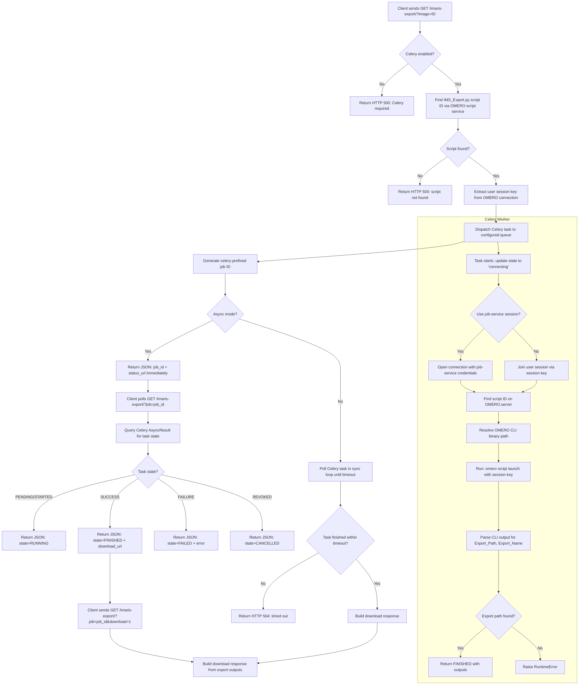

# Imaris Connector Plugin Workflow

This document describes the end-to-end control flow for `omeroweb_imaris_connector`, covering the Celery-backed asynchronous export path from request to download.

## Workflow diagram

## Phase-by-phase description

### 1. Request validation

- The client sends a GET request with `image` (or `image_id`) parameter.
- If a `job` (or `job_id`) parameter is present, the request is treated as a status poll instead of a new export.
- Optional `base_url` parameter allows overriding the status/download URL host for proxied environments.
- Optional `omero_port` parameter is validated but used only for advanced routing.

### 2. Session key extraction

- The view extracts the user's live OMERO session key from the authenticated connection.
- The session key is passed to the Celery task so the background worker can join the same OMERO session.
- OMERO host and port are resolved from the connection object, falling back to `OMEROHOST` and `OMERO_PORT` environment variables.

### 3. Celery task dispatch

- The task `run_ims_export_task` is dispatched to the configured queue (`OMERO_IMS_CELERY_QUEUE`).
- The task ID is prefixed with `celery-` to form the job ID returned to the client.
- The Celery worker runs inside the `omeroweb` container, managed by supervisord.

### 4. Task execution (in Celery worker)

- The worker opens an OMERO connection by either joining the user's existing session or authenticating with job-service credentials (`OMERO_IMS_USE_JOB_SERVICE_SESSION`).
- The IMS export script (`IMS_Export.py`) is located via the OMERO script service.
- The script is launched via `omero script launch` CLI inside the `omeroweb` container, with CLI state isolated under the plugin-managed `omero-cli` temp namespace.
- CLI output is parsed for structured output parameters: `Export_Path`, `Export_Name`, `File_Annotation_Id`, `Message`.
- Task state updates are pushed via Celery's `update_state` mechanism (`connecting` → `finding_script` → `running_script`).

### 5. Status polling

- The client polls with the job ID to check task progress.
- Celery `AsyncResult` state is mapped to normalized states: `RUNNING`, `FINISHED`, `FAILED`, `CANCELLED`.
- On `FINISHED`, the response includes a `download_url` that the client can use to retrieve the exported file.

### 6. Download

- The client requests the download by adding `download=1` to the status poll URL.
- The view validates that the export has finished before serving the file.
- The download response is built from the export outputs (file path, name, annotation ID).

### 7. Sync mode

- When `async=false` (default) or `wait=true`, the view enters a blocking poll loop.
- The loop polls Celery task state every `OMERO_IMS_EXPORT_POLL_INTERVAL` seconds.
- If the task completes within `OMERO_IMS_EXPORT_TIMEOUT`, the download response is returned directly.
- If the timeout expires, HTTP 504 is returned.

## Design rules

- Only Celery-backed exports are supported; direct synchronous script execution is not exposed to HTTP clients.
- The user's session key is preferred over the job-service account for OMERO CLI launch, preserving data access permissions.
- The OMERO CLI runs with isolated writable directories (`OMERO_USERDIR`, `OMERO_SESSIONDIR`, `OMERO_TMPDIR`) under the plugin-managed temp root to work in non-root containers.
- Task dispatch and status polling are separate HTTP requests; no WebSocket or SSE is used.

## Failure boundaries

- **Celery disabled**: HTTP 500 with explicit message; no fallback execution path.
- **Script not found**: HTTP 500 before any task is dispatched.
- **Session key unavailable**: task dispatch fails with `RuntimeError` before any Celery task is created.
- **CLI launch failure**: task fails with `RuntimeError`; Celery state set to `FAILURE` with metadata.
- **No export path in CLI output**: treated as failure even if CLI exit code is 0.
- **Poll timeout (sync mode)**: HTTP 504; the Celery task may still be running in the background.
- **Connection closed by user logout**: exports using the user's session key may fail if the session expires during execution.

## Related docs

- `imaris-connector-plugin.md`
- `../troubleshooting/imaris-export.md`
