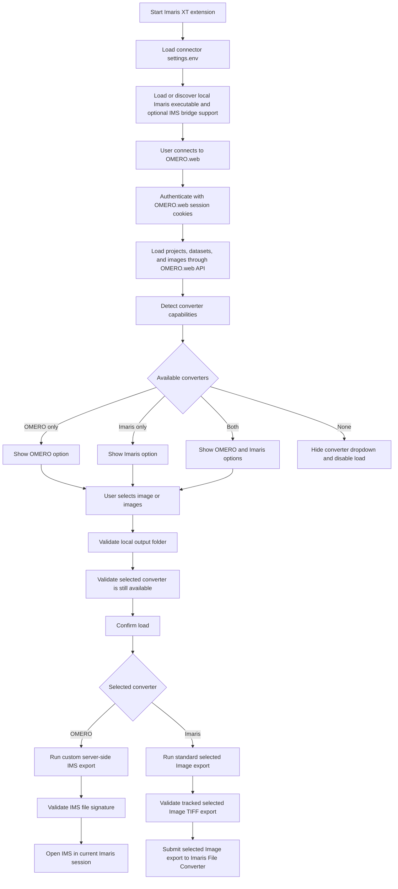
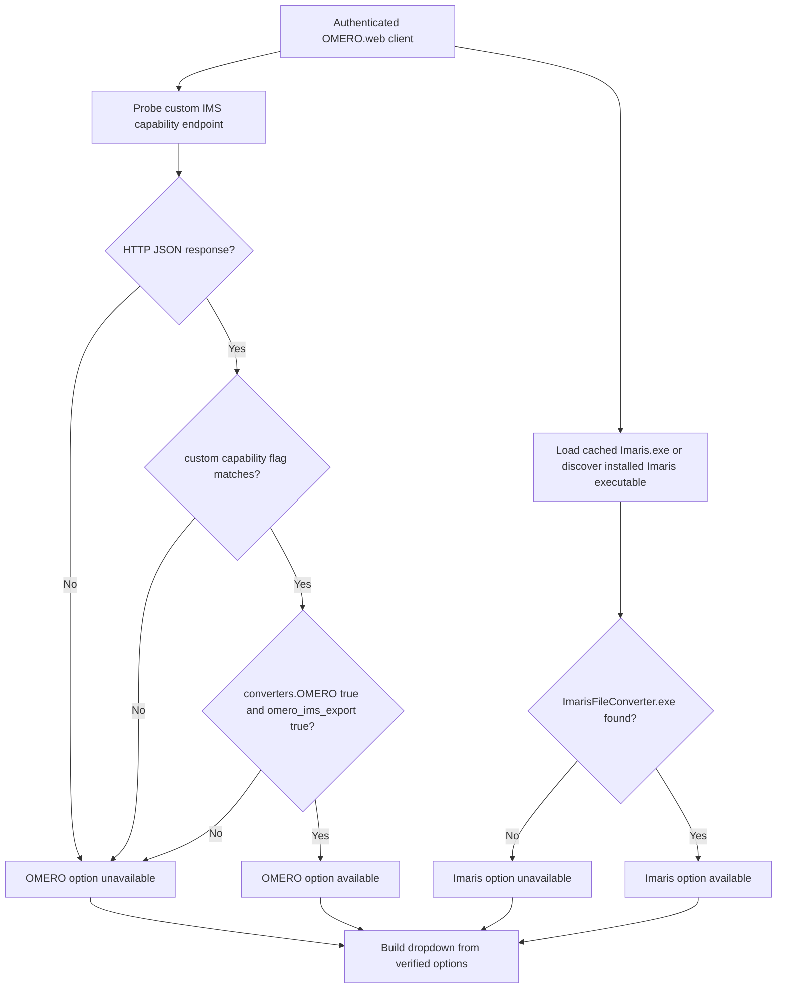
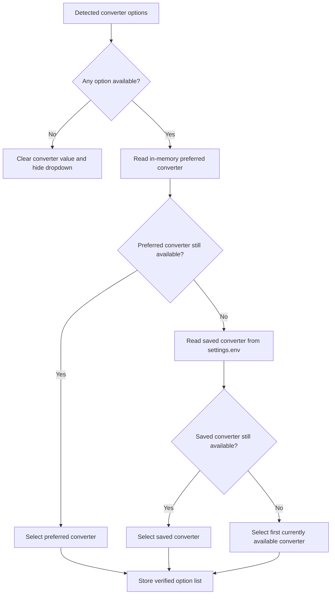
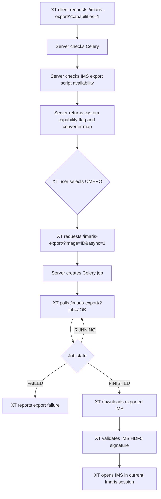
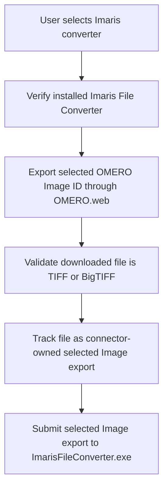
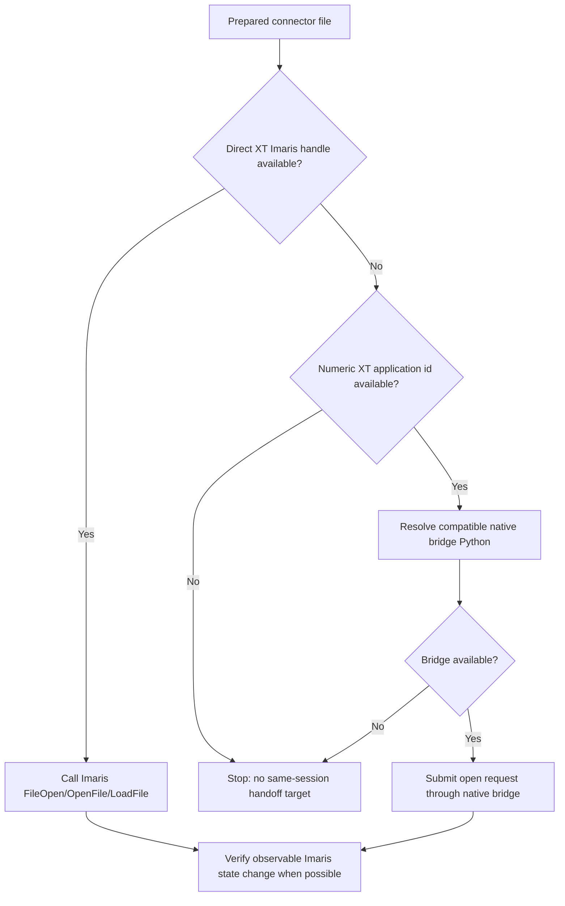
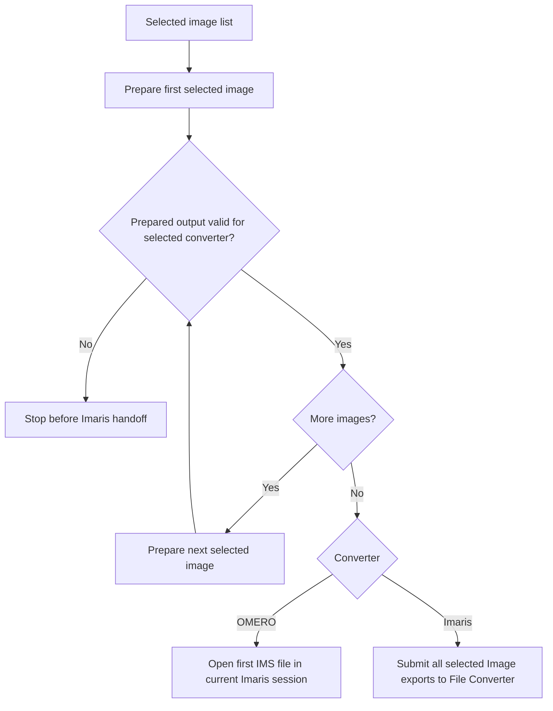

# Imaris Connector Plugin Workflow

This document describes the complete control flow for the OMERO-to-Imaris
connector. It covers the Imaris XT client
(`omero_imaris_connector/XTOmeroConnector.py`), the custom
`omero_imaris_connector` server endpoint, converter detection, selected Image
export behavior, IMS same-session handoff, selected-image converter handoff,
and the main failure boundaries.

The connector exposes two user-facing converter choices when the relevant
capabilities are present:

- `OMERO`: a custom server-side IMS export provided by this repository.
- `Imaris`: a standard OMERO.web selected Image export submitted to the
  installed Imaris File Converter, matching a user dropping the exported file
  onto the Imaris application icon without opening a new full Imaris session.

`OMERO` is intentionally hidden unless the connected OMERO.web instance returns
the repository capability flag `omero_imaris_connector_v1`. `Imaris` is
intentionally independent of that custom server capability and works with
standard OMERO.web installations that can export the selected OMERO Image ID.

## Top-level workflow

## Capability detection

Capability detection is performed after a successful OMERO.web login and before
the converter dropdown is populated.

The custom server capability contract is strict:

- The endpoint must return `omero_ims_export_capability`.
- The value must match `omero_imaris_connector_v1`.
- `converters.OMERO` must be `true`.
- `omero_ims_export` must be `true`.

Legacy responses such as `HTTP 400 Missing image id` do not enable the `OMERO`
converter. A standard, non-custom OMERO.web host therefore hides `OMERO`; this
is expected until the server-side connector endpoint has been installed or
updated.

The `Imaris` converter is not gated on the custom server endpoint and does not
run `ImarisConvert.exe` or any client-side conversion CLI. It requires a
discoverable installed `ImarisFileConverter.exe`, derived from a cached or
discovered `Imaris.exe` installation path, and the standard selected Image
export endpoint from OMERO.web.

On first startup, the connector records the discovered `Imaris.exe` path in the
connector-owned `settings.env` as `IMARIS_EXE`. On later startups, that saved
path is checked first and used directly when the executable still exists, so
the connector does not repeat registry or vendor-directory discovery.

## Saved converter settings

The connector stores the last selected converter in the connector-owned
`settings.env`. That value is treated as a preference only, never as authority.

At load time, the selected value is checked against the stored verified option
list again. If `settings.env` contains `OMERO` but the connected server no
longer exposes the custom capability flag, the connector refuses the stale value,
refreshes the dropdown from the verified options, and does not start a download.

## OMERO converter path

The `OMERO` converter is the custom server-side path in this repository. It
requires the custom OMERO.web app, Celery, and the IMS export script.

This path is custom by design. It must not appear for arbitrary OMERO
installations that do not explicitly expose this repository's capability flag.
For a standard non-custom OMERO.web host, a missing custom capability endpoint is
treated as ordinary absence of the `OMERO` converter, not as an Imaris converter
warning or failure.

## Imaris converter path

The `Imaris` converter is the generic client-side path intended to work with
standard OMERO.web installations and a local Imaris 11 or newer session. It does
not require the custom IMS export endpoint and it does not run local
client-side conversion.

On the client workstation, the XT connector startup gate requires Windows 10 or
later. Windows 11 is included by that version rule; the connector must not
special-case a single Windows release.

The path is source-format agnostic. It never downloads archived originals,
filesets, source containers, nested folder payloads, or repository-managed
source paths. The original data may come from any OMERO-supported source,
including high-content screening layouts and OME-Zarr-backed images, because the
client requests only the selected OMERO Image ID through standard OMERO.web.
Diagnostics for this path are scoped as `Imaris converter` messages; normal
absence of the custom server-side OMERO converter must not leak into this path.

The selected Image export uses the OMERO.web image export endpoint for the
selected Image ID. The OME-TIFF file is the standard OMERO.web transport
envelope for the selected Image pixels; it is not a source-filetype decision and
it is not a download of the archived original container. The client does not use
`webgateway/archived_files/download/`. If the selected Image export is
unavailable, the connector fails explicitly instead of falling back to
original-file download. The final handoff uses the discovered
`ImarisFileConverter.exe` with the tracked downloaded export as its file
argument; it does not use the main `Imaris.exe` as a fallback, and it does not use
`ImarisLib.FileOpen`, `OpenFile`, `LoadFile`, Windows file associations, or a
source-filetype-specific parser for this path.

## OMERO IMS same-session handoff

After the `OMERO` converter prepares a verified IMS file, the XT client opens it
in the current Imaris session.

The load workers validate converter-specific outputs before any handoff request
is made. The `OMERO` path requires IMS/HDF5 and uses the same-session bridge.
The `Imaris` path requires a TIFF/BigTIFF file that was downloaded and tracked
by the same dialog instance as a selected Image export, then submits that file
to the installed Imaris File Converter.

## Browser search

When `Search function` is enabled, the XT dialog shows search fields directly
above the Projects, Datasets, and Images lists. The fields filter only the data
already loaded into each panel, using case-insensitive partial text matching, so
typing does not trigger additional OMERO.web requests or background conversion
work. Clearing a search restores the full loaded list for that panel.

## Multi-image loading

Multi-image loading uses the same converter-specific preparation as single-image
loading, but it waits until every selected image has produced a valid output
before any Imaris handoff. The `OMERO` converter opens only the first prepared
IMS file in the current Imaris 11 session and leaves the remaining IMS exports
in the selected folder. This avoids a confusing sequential XT file-open handoff
where additional images can be difficult to find or select in the Imaris 11
interface. Users can open the saved IMS files from that folder or use them as
inputs for an Imaris 11 Workflow/Batch processing pipeline.

The `Imaris` converter path is different: all selected Image exports are passed
to one `ImarisFileConverter.exe` launch after the full batch is ready.

This prevents partial handoff where the first files open in Imaris and a later
download or export fails. For the `Imaris` converter, all tracked selected Image
exports are passed to one `ImarisFileConverter.exe` launch rather than separate
per-file launches. For the `OMERO` converter, all tracked IMS exports remain in
the selected folder even though only the first one is opened automatically.

## Failure boundaries

- No authenticated OMERO.web session: the connector refuses browsing and export.
- Custom capability flag missing: the `OMERO` converter is hidden.
- Custom capability flag present but `converters.OMERO` false: the `OMERO`
  converter is hidden.
- Stale saved converter value: the stale option is ignored and cannot start a
  load.
- No same-session Imaris handoff target for `OMERO`: no server-side IMS export
  is started.
- No discoverable `ImarisFileConverter.exe` for `Imaris`: no selected Image
  export is started.
- Selected Image export endpoint unavailable: the `Imaris` path fails without
  downloading archived originals.
- Selected Image export is not TIFF/BigTIFF: the `Imaris` path rejects the file
  before any Imaris handoff.
- Untracked selected Image export: the `Imaris` path refuses to submit it.
- Server-side IMS download is not IMS/HDF5: the `OMERO` path rejects the file
  before any Imaris handoff.
- Multi-image preparation failure: no batch handoff is attempted.

## Verification points

The regression suite covers the critical contracts:

- `OMERO` converter requires the custom capability flag.
- Legacy custom-endpoint responses do not enable `OMERO`.
- `Imaris` converter does not require custom OMERO server support.
- `Imaris` converter does not require `ImarisConvert.exe` or any local
  client-side conversion CLI.
- Subsequent startups use a valid cached `IMARIS_EXE` settings value before any
  install-location discovery.
- Stale `settings.env` converter values are ignored.
- The `Imaris` path uses selected Image ID export.
- The `Imaris` path does not call archived original download.
- The `Imaris` path does not query Image detail metadata for conversion hints.
- The `Imaris` path submits only tracked selected Image exports to
  `ImarisFileConverter.exe`.
- Multi-image `Imaris` loads submit all selected Image exports in one File
  Converter batch.
- Browser search filters already-loaded Projects, Datasets, and Images by
  partial text without additional server calls.
- The `OMERO` path rejects non-HDF5 IMS download responses.
- Single-image and multi-image load workers require converter-specific valid
  outputs before Imaris handoff.
- Optional live OMERO coverage is available through `OMERO_LIVE_HOST`,
  `OMERO_LIVE_PORT`, `OMERO_LIVE_SCHEME`, `OMERO_LIVE_USER`,
  `OMERO_LIVE_PASSWORD`, and `OMERO_LIVE_IMAGE_ID`. The live test authenticates,
  downloads the selected Image export, and checks server-side IMS export when
  the custom capability exists.

## Related docs

- `imaris-connector-plugin.md`
- `../troubleshooting/imaris-export.md`
