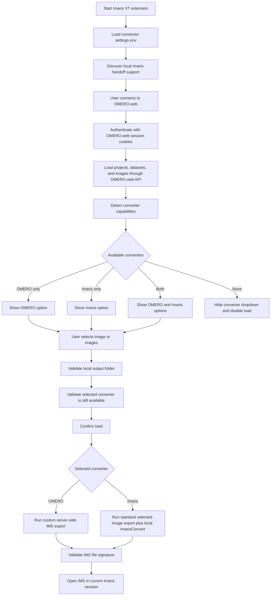
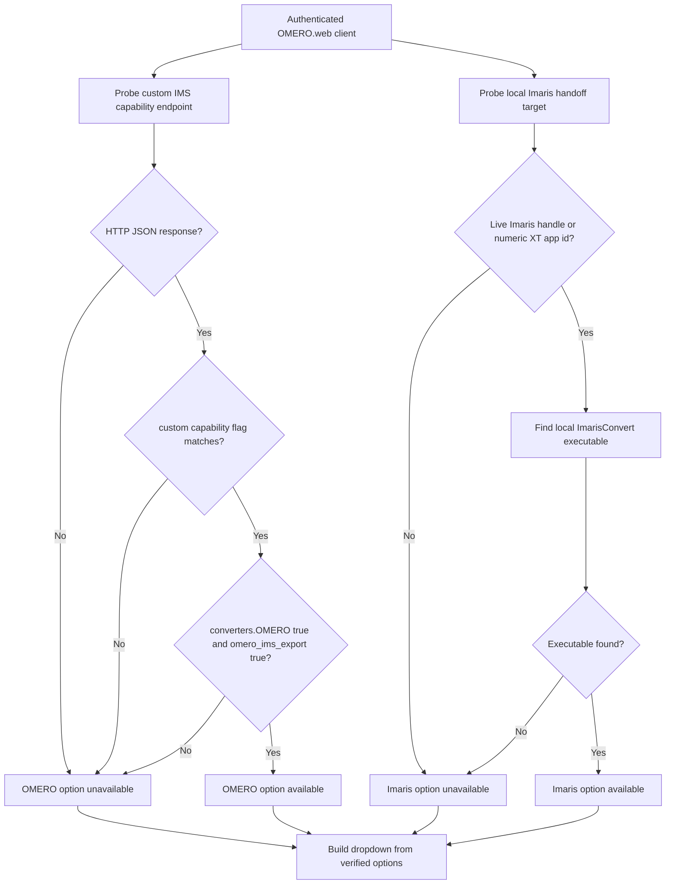
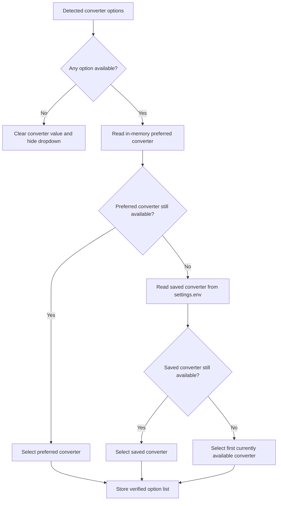
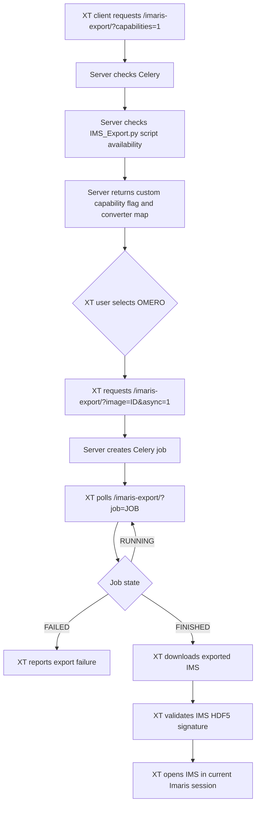
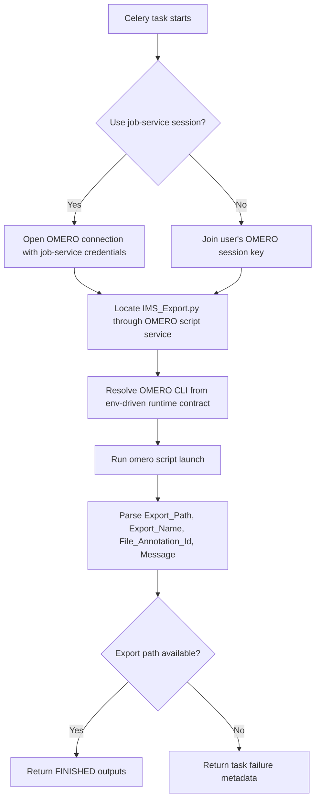
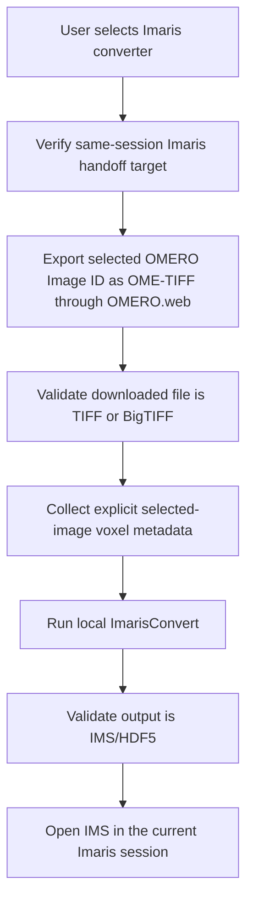
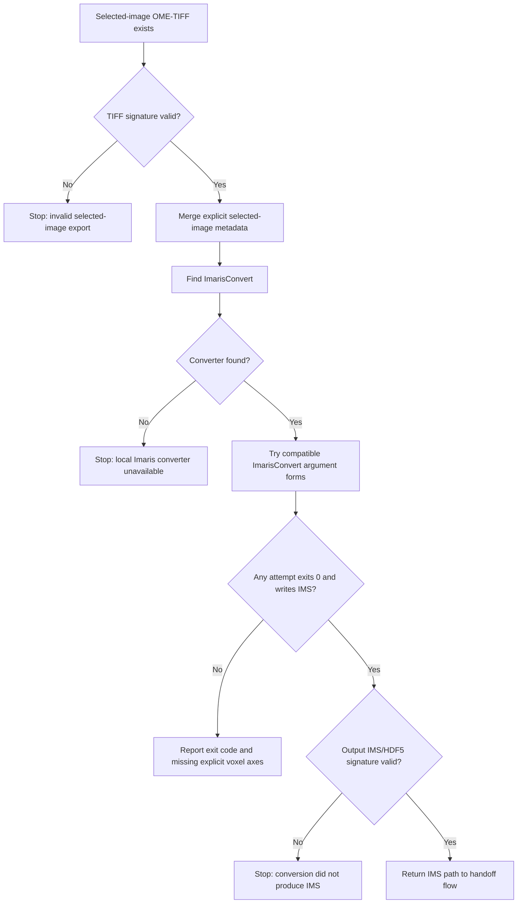
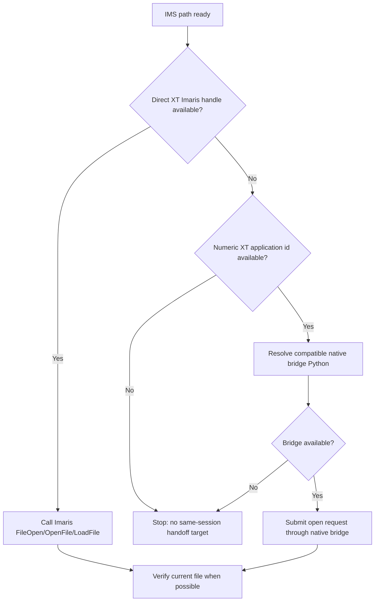
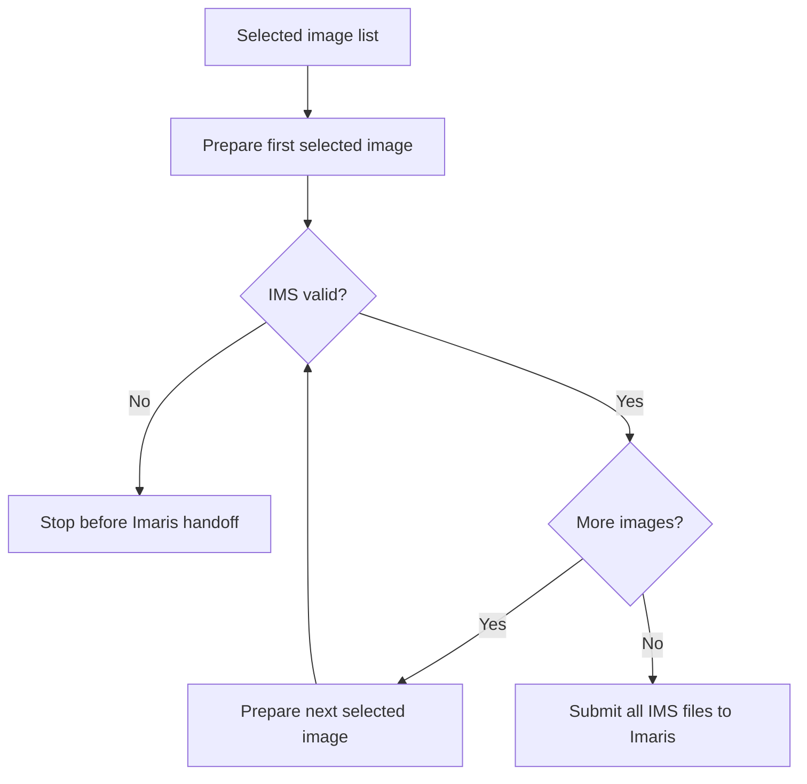

# Imaris Connector Plugin Workflow

This document describes the complete control flow for the OMERO-to-Imaris
connector. It covers the Imaris XT client (`omero_imaris_connector/XTOmeroConnector.py`), the custom
`omero_imaris_connector` server endpoint, converter detection, selected-image
download behavior, local Imaris conversion, same-session Imaris handoff, and the
main failure boundaries.

The connector exposes two user-facing converter choices when the relevant
capabilities are present:

- `OMERO`: a custom server-side IMS export provided by this repository.
- `Imaris`: a host-side conversion path that uses standard OMERO.web selected
  Image ID export, then converts that export with the locally installed Imaris
  converter.

`OMERO` is intentionally hidden unless the connected OMERO.web instance returns
the repository-specific custom capability flag. `Imaris` is intentionally
independent of that custom server capability.

## Top-level workflow

## Capability detection

Capability detection is performed after a successful OMERO.web login and before
the converter dropdown is populated.

The custom server capability contract is strict:

- The endpoint must return `omero_ims_export_capability`.
- The value must match the repository-defined capability flag.
- `converters.OMERO` must be `true`.
- `omero_ims_export` must be `true`.

Legacy responses such as `HTTP 400 Missing image id` do not enable the `OMERO`
converter. This prevents a non-custom OMERO.web installation from being treated
as if it supports the repository's custom IMS export.

The `Imaris` converter is not enabled merely because Imaris is installed. The XT
client also requires an Imaris handoff target and a local Imaris conversion
executable. Discovery is installation-agnostic: environment overrides, Imaris
install roots, registry/vendor locations, and `PATH` are checked without
hard-coding a single host path.

## Saved converter settings

The connector stores the last selected converter in the connector-owned
`settings.env`. That value is treated as a preference only, never as authority.

At load time, the selected value is checked against the stored verified option
list again. If `settings.env` contains `OMERO` but the connected server no
longer exposes the custom capability flag, the connector refuses the stale value,
refreshes the dropdown from the verified options, and does not start a download.

## OMERO converter path

The `OMERO` converter is the custom server-side path in this repository. It
requires the custom OMERO.web app, Celery, and the IMS export script.

Server-side job execution:

This path is custom by design. It must not appear for arbitrary OMERO
installations that do not explicitly expose this repository's capability flag.
For a standard non-custom OMERO.web host, a missing custom capability endpoint is
treated as an ordinary absence of the `OMERO` converter, not as an Imaris
converter warning or failure.

## Imaris converter path

The `Imaris` converter is the generic path intended to work with standard
OMERO.web installations and a local Imaris 11 or newer installation. It does not
require the custom IMS export endpoint or the server-side Imaris conversion
script.

On the client workstation, the XT connector startup gate requires Windows 10 or
later. Windows 11 is included by that version rule; the connector must not
special-case a single Windows release.

The path is source-format agnostic. It never downloads archived originals,
filesets, source containers, nested folder payloads, or repository-managed
source paths. The original data may come from any OMERO-supported source,
including high-content screening layouts and OME-Zarr-backed images, because the
client requests only the selected OMERO Image ID through standard OMERO.web.
Diagnostics for this path are scoped as `Imaris converter` messages; normal
absence of the custom server-side OMERO converter must not leak into this path.

The selected-image export uses the OMERO.web image export endpoint for the
selected Image ID. The OME-TIFF file is only the standard OMERO.web transport
envelope for the selected Image pixels that ImarisConvert can read locally; it
is not a source-filetype decision and it is not a download of the archived
original container. The client does not use
`webgateway/archived_files/download/`. If the selected-image OME-TIFF export is
unavailable, the connector fails explicitly instead of falling back to
original-file download.

Voxel-size metadata is handled without guessing. The connector may pass
`-vsx`, `-vsy`, and `-vsz` to ImarisConvert only when the corresponding value is
explicitly present in selected Image metadata returned by OMERO.web or in the
selected-image OME-TIFF metadata. Missing axes remain missing; the connector does
not infer Z from X/Y, single-plane status, source filename, source format, or any
installation-specific rule.

Local conversion:

The connector reports Windows breakpoint-style converter failures with both
decimal and unsigned hexadecimal process exit codes, so failures such as
`0x80000003` remain visible in diagnostics.

## Imaris same-session handoff

After either converter produces a valid IMS, the XT client opens the file in the
current Imaris session.

The load workers validate that the file is IMS before any Imaris open request is
made. Non-IMS files are rejected at the connector boundary.

## Multi-image loading

Multi-image loading uses the same converter-specific preparation as single-image
loading, but it waits until every selected image has produced a valid IMS before
submitting any file to Imaris.

This prevents partial handoff where the first files open in Imaris and a later
download or conversion fails.

## Failure boundaries

- No authenticated OMERO.web session: the connector refuses browsing and export.
- Custom capability flag missing: the `OMERO` converter is hidden.
- Custom capability flag present but `converters.OMERO` false: the `OMERO`
  converter is hidden.
- No local ImarisConvert executable: the `Imaris` converter is hidden.
- Stale saved converter value: the stale option is ignored and cannot start a
  load.
- No same-session Imaris handoff target: no download or conversion is started.
- Selected-image OME-TIFF endpoint unavailable: the `Imaris` path fails without
  downloading archived originals.
- Selected-image voxel metadata missing for an axis required by ImarisConvert:
  the `Imaris` path reports the missing explicit axis and does not invent a
  voxel size.
- Local Imaris converter nonzero exit: the connector reports the exit code and
  bounded stdout/stderr.
- Server-side IMS download is not IMS/HDF5: the `OMERO` path rejects the file
  before any Imaris handoff.
- Local conversion output is not IMS/HDF5: the connector refuses to open it.
- Multi-image preparation failure: no batch handoff is attempted.

## Verification points

The regression suite covers the critical contracts:

- `OMERO` converter requires the custom capability flag.
- Legacy custom-endpoint responses do not enable `OMERO`.
- `Imaris` converter requires local Imaris conversion support.
- Stale `settings.env` converter values are ignored.
- The `Imaris` path uses selected Image ID OME-TIFF export.
- The `Imaris` path does not call archived original download.
- The `Imaris` path passes only explicit selected-image voxel sizes to
  ImarisConvert.
- The `Imaris` path fails missing-Z metadata without guessing a replacement.
- Local Imaris conversion command construction is checked, including the
  documented `-vsx`, `-vsy`, and `-vsz` flags.
- The `OMERO` path rejects non-HDF5 IMS download responses.
- Breakpoint-style local conversion exit codes include hexadecimal diagnostics.
- Single-image and multi-image load workers require valid IMS outputs before
  Imaris handoff.
- Optional live OMERO coverage is available through `OMERO_LIVE_HOST`,
  `OMERO_LIVE_PORT`, `OMERO_LIVE_SCHEME`, `OMERO_LIVE_USER`,
  `OMERO_LIVE_PASSWORD`, and `OMERO_LIVE_IMAGE_ID`. The live test authenticates,
  downloads the selected-image OME-TIFF, checks server-side IMS export when the
  custom capability exists, and can run local Imaris conversion only when
  `IMARIS_OMERO_RUN_LIVE_IMARIS_CONVERSION` is explicitly enabled.

## Related docs

- `imaris-connector-plugin.md`
- `../troubleshooting/imaris-export.md`
