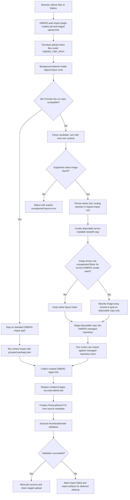

# Import Plugin Workflow

This document describes the end-to-end control flow for `omeroweb_import`, with emphasis on the native OME-Zarr path introduced for directory-backed imports that Bio-Formats cannot import directly.

## Workflow diagram

## Phase-by-phase description

### 1. Upload and staging

- The browser uploads files into a job-specific staged tree under `OMERO_TMP_PATH`.
- Directory structure is preserved. The plugin does not flatten directory-backed formats.
- Upload handling is request-safe: the heavy format planning is deferred so the final upload request does not block on a long dry-run scan.
- External clients can drive the same lifecycle without the browser UI. When a
  client starts the job with `dataset_name_override` and no `project_id`, the
  import target becomes one OMERO-root Dataset named by that override.
- The XT connector uses Tk's built-in directory chooser for that external-client
  path, so the selection step stays compatible with older Windows shells
  instead of depending on Explorer-specific automation.

### 2. Logical import planning

- The plugin asks OMERO/Bio-Formats for a dry-run grouping plan.
- That output becomes the source of truth for logical import units.
- Dataset creation and later import execution both follow the same persisted plan.
- `dataset_name_override` short-circuits the normal path-derived dataset naming
  logic so all uploaded entries land in the explicitly requested Dataset.
- The request path should prepare missing Dataset targets when possible, but the import worker can also create them later through an independent admin-created user session if planning finished after the upload response returned.

### 3. Route decision

- If Bio-Formats says the input is compatible, the plugin stays on the standard `omero import` path.
- If Bio-Formats rejects a candidate `.zarr`, the plugin parses it with the installed upstream `ome-zarr` runtime.
- The plugin routes to the native Zarr path only when the parsed store matches a layout the installed `omero-cli-zarr` runtime can actually import safely.

### 4. Managed-repository handoff for native Zarr

- The browser-staged tree is not imported in place.
- OMERO.web prepares a disposable server-readable tmp/shared-transfer copy, and any conversion or normalization work stays on that disposable copy.
- Only the final persistent handoff is staged into the managed repository through a server-side helper.
- This keeps the original staged upload private to `omero-web` and ensures the imported `externalInfo.lsid` points at a durable OMERO-managed store.

### 5. Disposable normalization

- The plugin does not flatten or rewrite supported OME-Zarr structure wholesale.
- It only rewrites image-array chunks when the current OMERO render stack cannot consume the array compressor reliably.
- Non-image metadata groups, tables, and layout structure remain intact.
- The rewrite applies only to the disposable native-import copy, never to the user's original upload tree.

### 6. Native import

- The managed-repository handoff copy is imported with `omero zarr import`.
- The logical image or grouped-series naming is preserved through the import plan instead of patched afterward.

### 7. Metadata finalization

- After import, the plugin resolves each created image back to its backing Zarr store through `externalInfo.lsid`.
- It reads canonical source metadata and persists physical pixel sizes on the OMERO `Pixels` object.
- Unit normalization is applied before persistence so shorthand NGFF units such as `nm` and `µm` are stored in OMERO-compatible form.

### 8. Post-import validation

- Import success is not inferred solely from the CLI exit code.
- The plugin extracts created object IDs from CLI output, validates the imported image/store relationship, and exercises thumbnail/render behavior before reporting success.
- If validation fails, the job is reported as failed even if the transaction created OMERO objects.

## Design rules

- Use Bio-Formats dry-run output as the grouping authority for all formats.
- Use `ome-zarr` parsing for native Zarr routing decisions instead of filename guesses.
- Preserve supported OME-Zarr layout semantics.
- Mutate only the disposable native-import copy when the current runtime requires it.
- Never route non-Zarr imports through the native Zarr branch.
- Keep timeouts environment-driven.
- Never reopen the live browser OMERO.web session in background import work.
- Never assume `job-service.suConn()` can safely impersonate the importing user for Dataset creation or file-attachment follow-up work.

## Failure boundaries

- **Upload failure**: staged files remain for retry or cleanup.
- **Unsupported Zarr layout**: explicit validation failure, no silent fallback guessing.
- **Managed-repository handoff failure**: import aborts before `omero zarr import`.
- **Metadata finalization failure**: import is treated as failed because created images are incomplete.
- **Render/thumbnail validation failure**: import is treated as failed because the created object is not operational in OMERO.web.

## Related docs

- `import-plugin.md`
- `omero-web-zarr-plugin.md`
- `omero-web-zarr-workflow.md`
