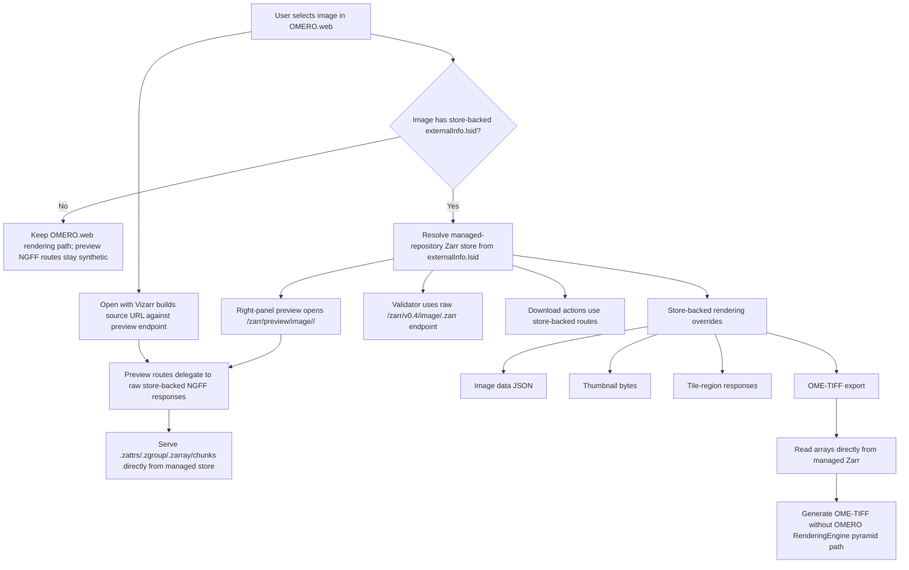

# OMERO.web Zarr Workflow

This document describes how `omero_web_zarr` serves managed-repository OME-Zarr images for viewing, preview, metadata access, and downloads.

## Workflow diagram

## Endpoint contracts

### Raw endpoint

Base form:

- `/zarr/v0.4/image/<image_id>.zarr/...`

Purpose:

- expose the original managed-repository NGFF structure,
- support standards validation,
- keep the original dataset keys and metadata documents visible.

### Preview endpoint

Base form:

- `/zarr/v0.4/preview/image/<image_id>.zarr/...`

Purpose:

- keep browser preview and Vizarr browsing on a preview-specific OMERO.web URL namespace,
- expose the same underlying store-backed NGFF payload used by the raw endpoint.

For non-store-backed images, preview `.zattrs` and `.zgroup` stay on the synthetic OMERO-backed path, while preview `.zarray` and chunk requests delegate directly to the raw synthetic responses instead of attempting managed-store dataset remapping.

## Rendering and UI integration

For store-backed images, `omero_web_zarr` intercepts selected OMERO.web behaviors and serves them directly from the Zarr store:

- channel metadata decoration,
- image-data payload used by OMERO.web viewers,
- thumbnail generation,
- region/tile rendering,
- right-panel preview,
- store-backed download actions.

For non-store-backed images, the plugin keeps the standard OMERO.web and OMERO RenderingEngine data path.

The OMERO.web right-panel preview page remains store-backed only. If an image is not store-backed, that page redirects back to the standard OMERO.web metadata preview. `Open with Vizarr` still targets the preview NGFF endpoint for all images, which is why the non-store-backed preview route delegation above matters.

The `/zarr/vizarr/` and `/zarr/validator/` launchers are thin OMERO-hosted shells. They normalize root-relative `source=` parameters against the browser's actual public origin and redirect static app assets to the upstream app origin instead of proxying every asset through Gunicorn.

## Download workflow

The plugin adds dedicated download actions for store-backed images:

- **original store**: zip archive of the managed Zarr tree,
- **metadata manifest**: collected metadata documents from the store,
- **OME-TIFF**: export generated directly from store-backed arrays.

These downloads are independent of the classic OMERO pyramid TIFF path and therefore remain available even when RE-based exports are not.

## Hardware acceleration

- Browser-side Vizarr can use WebGL on the client GPU when supported by the browser and workstation.
- Server-side `omero_web_zarr` rendering and export are CPU-side.
- The plugin does not assume or require server GPU acceleration.

## Failure model

- **Invalid raw path**: return `404` for missing metadata/chunk paths.
- **Invalid preview level**: reject it before trying to access a non-existent backing dataset.
- **Missing managed store**: fall back to stock behavior only for non-store-backed images; store-backed routes return explicit failure.
- **Server-side Zarr reader failure**: if OMERO.server fails inside `loci.formats.in.ZarrReader` while reading raw bytes for a non-store-backed image, that is an upstream reader-stack failure. `omero_web_zarr` can keep the launcher and synthetic metadata routes correct, but it cannot make Vizarr browse data that OMERO.server itself cannot read through the standard path.
- **Unsupported export axes**: OME-TIFF export rejects non-image-axis layouts explicitly instead of silently inventing output structure.

## Related docs

- `omero-web-zarr-plugin.md`
- `import-plugin.md`
- `import-plugin-workflow.md`
