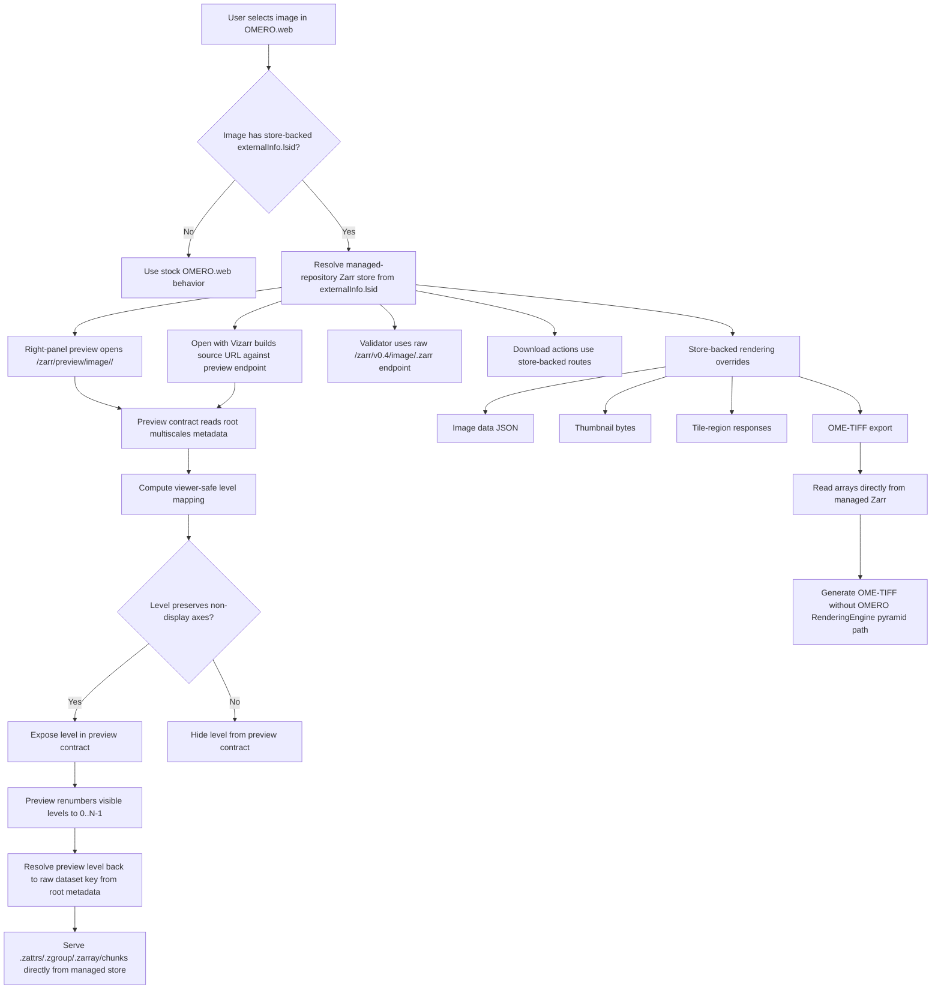

# OMERO.web Zarr Workflow

This document describes how `omero_web_zarr` serves managed-repository OME-Zarr images for viewing, preview, metadata access, and downloads.

## Workflow diagram

## Endpoint contracts

### Raw endpoint

Base form:

- `/zarr/v0.4/image/<image_id>.zarr/...`

Purpose:

- expose the original managed-repository NGFF structure,
- support standards validation,
- keep the original dataset keys and metadata documents visible.

### Preview endpoint

Base form:

- `/zarr/v0.4/preview/image/<image_id>.zarr/...`

Purpose:

- keep browser preview and Vizarr browsing correct for store-backed images,
- expose only viewer-safe multiscale levels,
- keep preview level numbers stable for the browser while resolving them back to underlying dataset keys.

## Preview level mapping

The preview contract follows a strict rule:

- `x` and `y` may downsample;
- `z`, `c`, and `t` must remain unchanged for a level to be preview-safe.

If the store contains only one viewer-safe level, preview exposes only that level. This can make browser viewing slower, but it prevents wrong-plane or blurred slice rendering.

This rule is derived from store metadata and array shapes. It does not depend on:

- filenames,
- specific dataset keys,
- directory names,
- vendor-specific assumptions.

## Rendering and UI integration

For store-backed images, `omero_web_zarr` intercepts selected OMERO.web behaviors and serves them directly from the Zarr store:

- channel metadata decoration,
- image-data payload used by OMERO.web viewers,
- thumbnail generation,
- region/tile rendering,
- right-panel preview,
- store-backed download actions.

Non-store-backed images continue through the standard OMERO.web and OMERO RenderingEngine paths.

## Download workflow

The plugin adds dedicated download actions for store-backed images:

- **original store**: zip archive of the managed Zarr tree,
- **metadata manifest**: collected metadata documents from the store,
- **OME-TIFF**: export generated directly from store-backed arrays.

These downloads are independent of the classic OMERO pyramid TIFF path and therefore remain available even when RE-based exports are not.

## Hardware acceleration

- Browser-side Vizarr can use WebGL on the client GPU when supported by the browser and workstation.
- Server-side `omero_web_zarr` rendering and export are CPU-side.
- The plugin does not assume or require server GPU acceleration.

## Failure model

- **Invalid raw path**: return `404` for missing metadata/chunk paths.
- **Invalid preview level**: reject it before trying to access a non-existent backing dataset.
- **Missing managed store**: fall back to stock behavior only for non-store-backed images; store-backed routes return explicit failure.
- **Unsupported export axes**: OME-TIFF export rejects non-image-axis layouts explicitly instead of silently inventing output structure.

## Related docs

- `omero-web-zarr-plugin.md`
- `import-plugin.md`
- `import-plugin-workflow.md`
