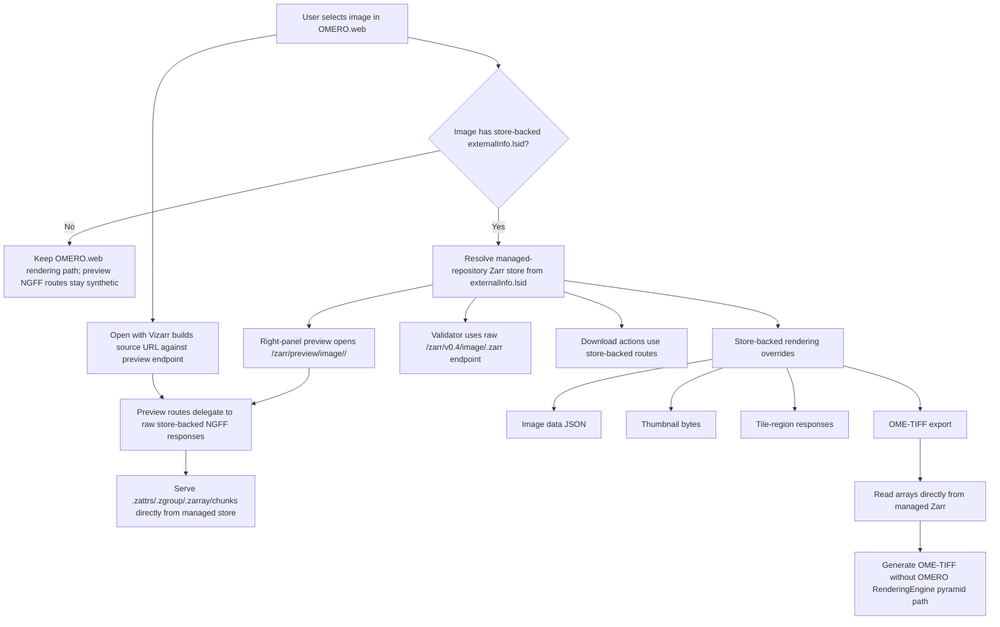

# OMERO.web Zarr Workflow

This document describes how `omero_web_zarr` serves managed-repository OME-Zarr images for viewing, preview, metadata access, and downloads.

## Workflow diagram

## Endpoint contracts

### Raw endpoint

Base form:

- `/zarr/v0.4/image/<image_id>.zarr/...`

Purpose:

- expose the original managed-repository NGFF structure,
- support standards validation,
- keep the original dataset keys and metadata documents visible.

### Preview endpoint

Base form:

- `/zarr/v0.4/preview/image/<image_id>.zarr/...`

Purpose:

- keep browser preview and Vizarr browsing on a preview-specific OMERO.web URL namespace,
- expose the same underlying store-backed NGFF payload used by the raw endpoint.

For non-store-backed images, all preview routes delegate to the synthetic OMERO-backed NGFF responses.

## Rendering and UI integration

For store-backed images, `omero_web_zarr` intercepts selected OMERO.web behaviors and serves them directly from the Zarr store:

- channel metadata decoration,
- image-data payload used by OMERO.web viewers,
- thumbnail generation,
- region/tile rendering,
- right-panel preview,
- store-backed download actions.

For non-store-backed images, the plugin keeps the standard OMERO.web and OMERO RenderingEngine data path by default. The only exceptions are narrow fallbacks for known OMERO.server reader regressions that can leak into classic viewers:

- image-data marshaling falls back to safe generic tile-size metadata when OMERO raises the known `ZarrReader.getOptimalTileWidth()` tile-size failure,
- classic tile-region responses fall back to the same safe tile-size calculation for that same known failure,
- metadata-preview rendering falls back to an empty rendering-definition list when OMERO fails to instantiate the rendering engine with the known `ZarrPixelsService.getPixelBuffer` / pixel-buffer error path.

The OMERO.web right-panel preview page remains store-backed only. If an image is not store-backed, that page redirects back to the standard OMERO.web metadata preview. `Open with Vizarr` still targets the preview NGFF endpoint for all images, which is why the non-store-backed preview route delegation above matters.

The `/zarr/vizarr/` and `/zarr/validator/` launchers are thin OMERO-hosted
shells. Vizarr is pinned to the third-party vendored production build of
`hms-dbmi/vizarr` commit `be7ccc260e848a2829873c8746f32b4f43599435`, runs
Viv/deck.gl WebGL rendering and Zarrita Zarr reads in the browser, and receives
only authenticated Zarr endpoint URLs from OMERO.web. The launcher does not
classify the source by file name, extension, MIME type, or storage layout; it
normalizes only root-relative `source=` values against the browser's actual
public origin and redirects app assets to the pinned local Vizarr static tree or
the validator upstream origin instead of proxying every asset through Gunicorn.
The vendored Vizarr build keeps Viv's multiscale tile selection and switches
raw intensity tile rendering to linear interpolation, matching OMERO.iviewer's
interpolated display while still fetching native level `0` chunks at high zoom.

For regular OMERO images that are not store-backed, the runtime NGFF endpoint
uses the OMERO pixel pyramid when one exists. If OMERO has no pyramid for the
image, the endpoint keeps level `0` at native resolution and advertises
generated XY overview levels whose chunks are computed on demand from bounded
primary-pixels tile reads. This keeps Vizarr on its normal multiscale WebGL path
without file-name, extension, or storage-layout heuristics.

## Download workflow

The plugin adds dedicated download actions for store-backed images:

- **original store**: zip archive of the managed Zarr tree,
- **metadata manifest**: collected metadata documents from the store,
- **OME-TIFF**: export generated directly from store-backed arrays.

These downloads are independent of the classic OMERO pyramid TIFF path and therefore remain available even when RE-based exports are not.

## Hardware acceleration

- Browser-side Vizarr can use WebGL on the client GPU when supported by the browser and workstation.
- Server-side `omero_web_zarr` rendering and export are CPU-side.
- The plugin does not assume or require server GPU acceleration.

## Failure model

- **Invalid raw path**: return `404` for missing metadata/chunk paths.
- **Invalid preview level**: requests for non-existent backing dataset paths return `404`.
- **Missing managed store**: fall back to stock behavior only for non-store-backed images; store-backed routes return explicit failure.
- **Known classic-viewer tile-size regression on non-store-backed images**: `omero_web_zarr` now catches the specific OMERO failure signatures around `ZarrReader.getOptimalTileWidth()` and uses a safe generic tile-size fallback so classic OMERO.web image metadata and region requests do not 500 just because the server-side reader stack misreports tile size.
- **Known classic metadata-preview rendering-engine regression on non-store-backed images**: when OMERO.web cannot load rendering definitions because OMERO.server fails while instantiating the pixel buffer through `ZarrPixelsService.getPixelBuffer`, the metadata preview now returns a degraded but working preview context instead of crashing the whole panel.
- **3D-downsampled pyramids**: EM volume converters commonly downsample all
  three spatial axes (z, y, x) across pyramid levels. Vizarr and other
  2D-slice viewers select resolution level based on XY viewport zoom, so
  downsampled z-slices appear blurry. The import plugin's ephemeral
  normalization step detects this and regenerates pyramid levels with XY-only
  downsampling before the managed-repository handoff, so imported stores always
  have sharp z-slices at every resolution level. Full-resolution data (level 0)
  is never modified.
- **Server-side Zarr reader failure**: if OMERO.server fails inside `loci.formats.in.ZarrReader` while reading raw bytes for a non-store-backed image, that is an upstream reader-stack failure. `omero_web_zarr` can keep the launcher and synthetic metadata routes correct, but it cannot make Vizarr browse data that OMERO.server itself cannot read through the standard path.
- **Unsupported export axes**: OME-TIFF export rejects non-image-axis layouts explicitly instead of silently inventing output structure.

## Related docs

- `omero-web-zarr-plugin.md`
- `import-plugin.md`
- `import-plugin-workflow.md`
