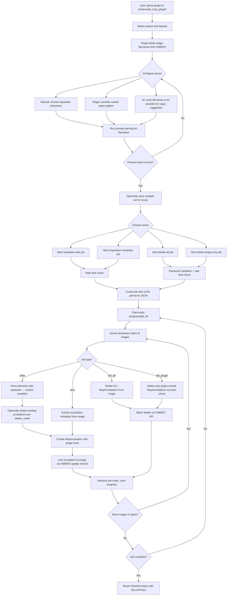

# OMP Plugin Workflow

This document describes the end-to-end control flow for `omeroweb_omp_plugin`, covering filename parsing, AI-assisted regex generation, metadata annotation, and annotation deletion.

## Workflow diagram

## Phase-by-phase description

### 1. Project and image selection

- User selects a project; datasets and image filenames load via OMERO gateway.
- Optionally, the user selects specific images instead of processing all images in the project.
- Root users are blocked from plugin actions.

### 2. Parser configuration

Three separator modes are supported:

- **Character mode** (`chars`): the user picks one or more separator characters (e.g. `_`, `-`, `.`). The plugin escapes them and builds a character-class regex.
- **Regex mode** (`regex`): the user provides a custom regex pattern directly. The plugin validates it against an unsafe-pattern denylist (no backreferences, no unbounded quantifiers) and compiles it before use.
- **AI regex mode** (`ai_regex`): the plugin sends sample filenames to a configured AI provider (Local/Ollama, Groq, Gemini, Claude, Perplexity, xAI, or Cohere) and receives a suggested regex. The suggestion is validated the same way as manual regex before use.

### 3. Preview and variable naming

- The user defines variable names for each parsed segment (up to 10 variables per set).
- Preview parsing runs client-side or server-side to show extracted values before committing.
- REMBI-aligned default variable names and scientific nomenclature-aware hyphen protection preserve domain terms like `5-HT` and `Z-stack`.

### 4. Variable set persistence

- Variable sets can be saved, loaded, and deleted per user (up to 10 sets per user).
- Storage is PostgreSQL-backed via `database_plugin` on port 5433.

### 5. Job creation and rate limiting

- Every major action (write, acquisition, delete-all, delete-plugin) creates a background job with a UUID.
- Per-user rate limiting enforces a maximum of 6 major actions per 60 seconds; violations return HTTP 429 with a cooldown message.
- Delete operations (delete-all, delete-plugin) additionally require the user's OMERO password for confirmation, validated via a transient OMERO session.

### 6. Chunked job execution

- The client polls `/progress/<job_id>/` repeatedly.
- Each poll processes a configurable batch of images (default chunk size: 5, user-adjustable 1–100).
- A portalocker file lock prevents concurrent poll requests from processing the same batch.
- Job state (index, totals, logs) is persisted to JSON between polls.

### 7. Annotation creation

- For write jobs: filenames are parsed with the configured separator, variables are mapped to key-value pairs, and a single `MapAnnotation` is created per image with namespace `openmicroscopy.org/omero/client/mapAnnotation`.
- Each annotation includes a plugin ownership hash (`omp_hash` key with `omphash_v1:` prefix) computed from the annotation content using an optional HMAC secret (`FMP_HASH_SECRET`).
- Duplicate variable names are auto-suffixed (e.g. `Var1`, `Var1_2`).
- The reserved `omp_hash` marker is never used for user metadata; colliding
  variable names are suffixed before the marker is added, and progress logs
  report visible entries separately from the `+1` plugin marker.
- Acquisition jobs store oversized metadata values in a text FileAnnotation and
  write a MapAnnotation marker only after that storage succeeds; failed storage
  is marked as not stored instead of claiming a missing attachment exists.

### 8. Annotation deletion

- **Delete-all**: removes all `MapAnnotation` objects from selected images via OMERO CLI batch delete (chunks of 100 images).
- **Delete plugin-only**: removes only annotations whose `omp_hash` key matches the current plugin hash, leaving third-party and hashless annotations intact.
- Job-based delete modes (`del_all`, `del_plugin`) process images through the same chunked progress loop as write jobs, using the OMERO update service.
- Direct (non-job) delete endpoints (`/delete_all/`, `/delete_plugin/`) use OMERO CLI subprocess calls for bulk operations.

## Design rules

- Annotations are always created as a single `MapAnnotation` per image per job execution, not one annotation per variable.
- Plugin hash verification prevents accidental deletion of annotations created by other tools; hashless legacy handling is explicit maintenance-only behavior.
- Rate limiting applies uniformly to all major actions regardless of job type.
- Regex patterns are validated and compiled before use; unsafe patterns are rejected at the request boundary.
- Job ownership is enforced: only the user who created a job can poll its progress.

## Failure boundaries

- **AI provider failure**: the plugin falls back to manual separator configuration; AI errors do not prevent manual workflow.
- **Rate limit exceeded**: HTTP 429 with cooldown timer; no job is created.
- **Password validation failure**: delete operations abort before any annotations are modified.
- **Partial batch failure**: individual image errors are logged per-image; the job continues processing remaining images.
- **Lock contention**: concurrent poll requests return the last-known progress without processing; no data corruption.

## Related docs

- `omp-plugin.md`
- `import-plugin.md`
